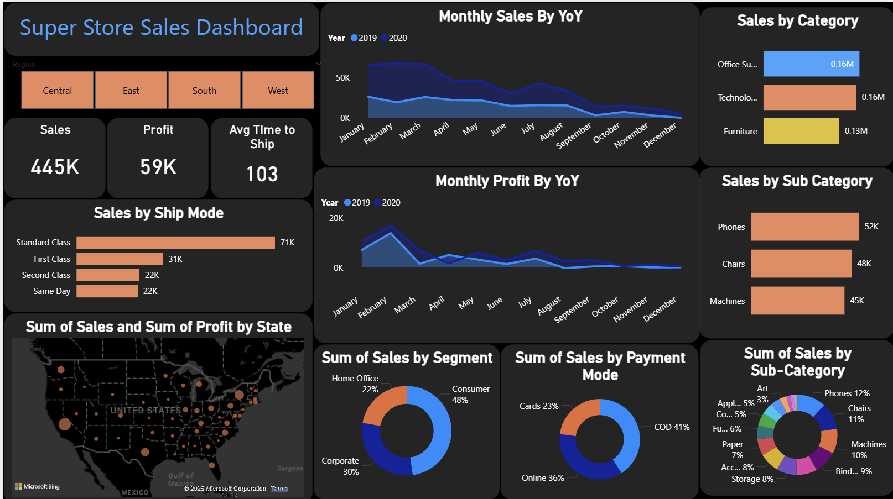

# 📊 Super Store Sales Dashboard (Power BI)


## Overview
This project is a **Power BI Sales Dashboard** built using the *Superstore dataset*.  
It provides interactive insights into **sales performance, profit trends, customer behavior, and shipping patterns**.  

The dashboard enables stakeholders to monitor KPIs, compare YoY trends, and make data-driven decisions.

---

## Features
- **KPI Cards** → Total Sales, Profit, Avg. Time to Ship  
- **Regional Filtering** → Central, East, South, West  
- **Time-Series Analysis** → Monthly sales & profit (2019 vs 2020)  
- **Category & Sub-Category Drilldown** → Identify top products  
- **Shipping Analysis** → Breakdown by ship mode  
- **Geo Analysis** → Sales and profit by U.S. state  
- **Customer & Payment Behavior** → Segments and modes  

---

## Key Insights
### 📈 Performance
- **Sales**: 445K  
- **Profit**: 59K  
- **Avg. Ship Time**: 103 days  

### 📊 Trends
- Sales peak in **Q1**, decline towards **year-end**  
- Profit spikes in **Feb–Mar**, fluctuates after  

### 🛒 Products
- **Top Categories**: Office Supplies & Technology (~0.16M each)  
- **Top Sub-Categories**: Phones (52K), Chairs (48K), Machines (45K)  

### 🚚 Shipping
- **Standard Class** dominates (71K)  
- **First Class / Same Day** less used  

### 🌍 Geography
- Strongest in **California, New York, Texas**  
- Some states show sales but **low profit**  

### 👥 Customers & Payments
- **Consumer Segment** → 48% of sales  
- **COD (41%)** + **Online (36%)** = preferred payment modes  

---

## Tech Stack
- **Tool**: Power BI Desktop  
- **Dataset**: Sample Superstore Dataset  
- **Techniques**:  
  - Data cleaning & modeling  
  - DAX for KPIs  
  - YoY time-series analysis  
  - Geo-mapping  
  - Interactive slicers & filters  

---

## Repository Structure
```bash
SuperStore-Sales-Dashboard/
├── data/                # Dataset (if shareable)
├── dashboard.pbix       # Power BI file
├── README.md            # Documentation
└── images/              # Dashboard screenshots
