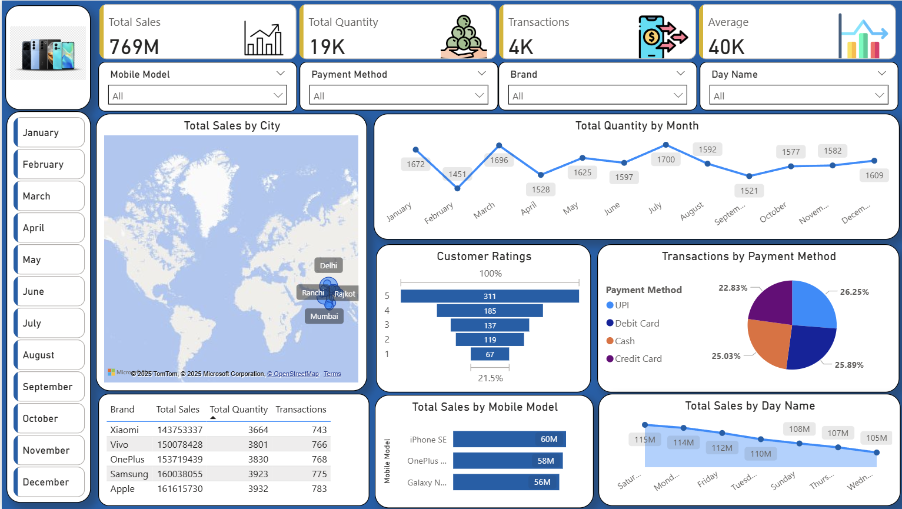

# 📊 Power BI Dashboards Collection

## Overview
This repository contains **interactive Power BI dashboards** built using real-world datasets.  
Each project demonstrates **data modeling, DAX calculations, visualizations, and storytelling** to derive actionable business insights.  

Currently, the repo includes:  
1. **Mobile Sales Dashboard**  
2. **Superstore Sales Dashboard**  

---

## 📁 Projects

### 01. 📱 Mobile Sales Dashboard
**Path:** `01_Mobile_Sales_Dashboard`  

A dashboard analyzing **mobile sales performance** with insights into total sales, quantities, transactions, customer satisfaction, brand/model breakdowns, and payment methods.  

**Key Features:**
- KPI Cards → Total Sales, Quantity, Transactions, Average Sales  
- Brand & Model Analysis → Top brands (Apple, Samsung, OnePlus, etc.) and popular models  
- Time Trends → Sales by month & day of week  
- Customer Ratings → Satisfaction distribution (1–5 stars)  
- Geo Analysis → City-level sales on map  
- Payment Methods → UPI, Debit, Credit, and Cash split  

**Preview:**  
  

---

### 02. 🏬 Superstore Sales Dashboard
**Path:** `02_SuperStore_Sales_Dashboard`  

A dashboard built on the classic **Superstore dataset**, focusing on sales and profit trends, customer segments, categories, shipping modes, and geographic insights.  

**Key Features:**
- KPI Cards → Total Sales, Profit, Avg. Time to Ship  
- Regional Filters → Central, East, South, West  
- Time-Series → Monthly sales & profit (YoY comparison)  
- Product Insights → Category & sub-category breakdown  
- Shipping Analysis → Standard, First Class, Same Day, etc.  
- Geo Analysis → State-wise sales & profit distribution  
- Customer Segments & Payment Modes  

**Preview:**  
  

---

## 🛠️ Tech Stack
- **Tool**: Power BI Desktop  
- **Datasets**: Mobile Sales Dataset, Sample Superstore Dataset  
- **Techniques**:  
  - Data Cleaning & Modeling  
  - DAX for KPIs and measures  
  - Time-series & trend analysis  
  - Geo-mapping  
  - Interactive slicers & filters  

---

## 📂 Repository Structure
```bash
PowerBi_DashBoards/
├── 01_Mobile_Sales_Dashboard/
│   ├── dashboard.pbix
│   ├── README.md
│   └── images/
│
├── 02_SuperStore_Sales_Dashboard/
│   ├── dashboard.pbix
│   ├── README.md
│   └── images/
│
└── README.md   # Main repo documentation
